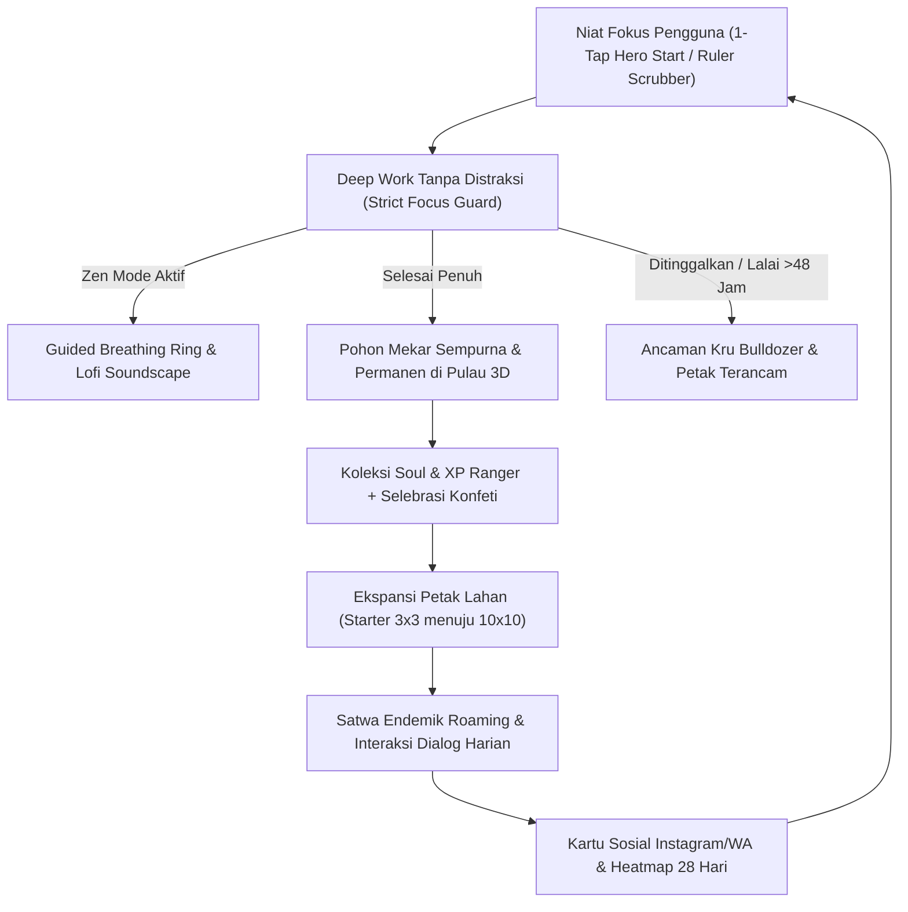
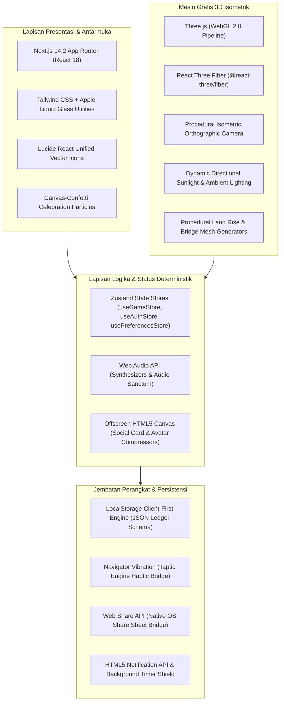
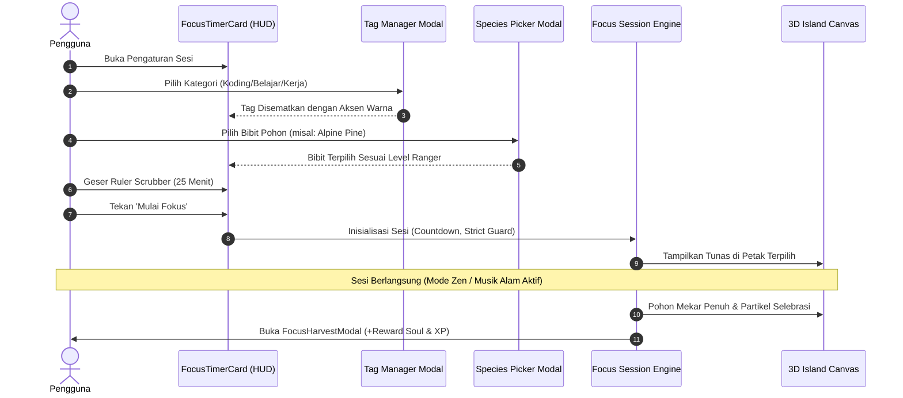
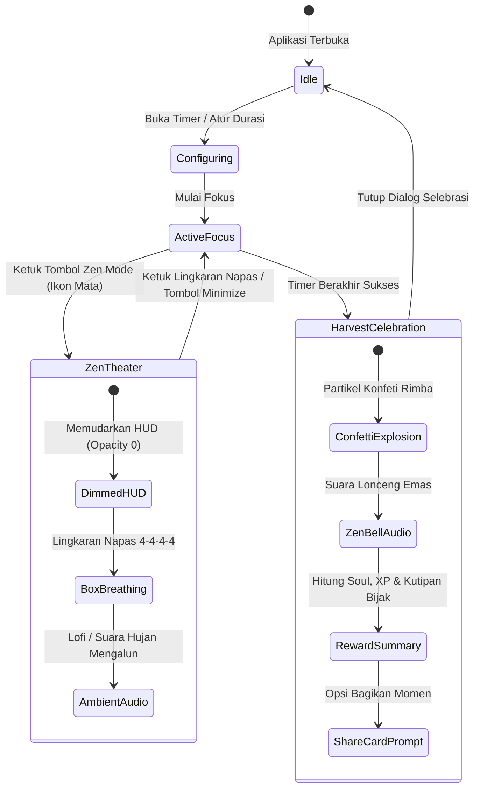
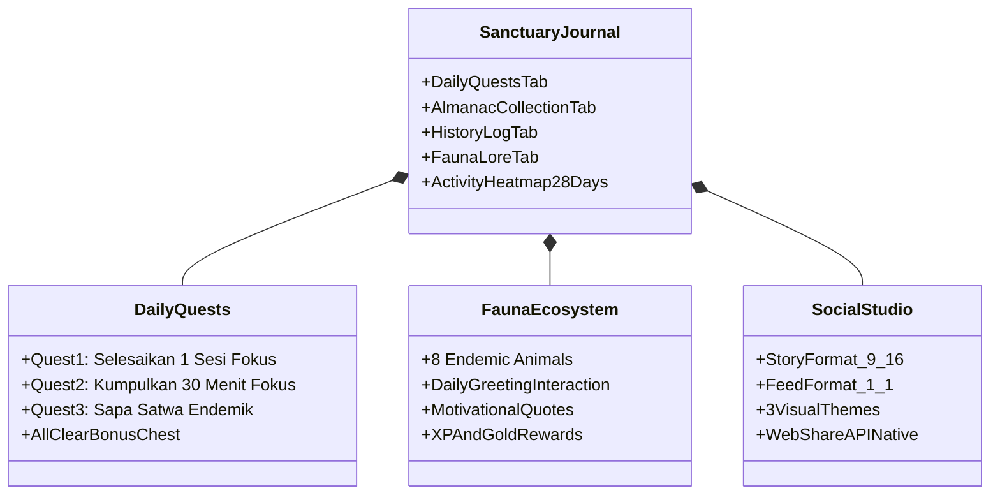

# 📄 RIMBA MOBILE: TECHNICAL & PRODUCT WHITEPAPER
### *A Gamified 3D Isometric Productivity Sanctuary & Calm Mindfulness Ecosystem*
**Versi:** 2.0.0 (Apple + Forest Minimalist Architecture Edition)  
**Status:** Produksi / Rilis Mobile Terverifikasi  
**Penyusun:** Tim Rekayasa Sistem, Desain Produk & Gamifikasi Rimba  
**Tanggal Publikasi:** Oktober 2026  

---

## Daftar Isi
1. [Ringkasan Eksekutif (Executive Summary)](#1-ringkasan-eksekutif-executive-summary)
2. [Evolusi Desain: Dari Antarmuka Bertumpuk ke Apple & Forest Minimalist](#2-evolusi-desain-dari-antarmuka-bertumpuk-ke-apple--forest-minimalist)
3. [Arsitektur Teknis & Tumpukan Perangkat Lunak (Tech Stack)](#3-arsitektur-teknis--tumpukan-perangkat-lunak-tech-stack)
4. [Pilar 1: Focus Flow, Micro-Tagging & Species Selection (Forest-Parity)](#4-pilar-1-focus-flow-micro-tagging--species-selection-forest-parity)
5. [Pilar 2: Ekspansi Spasial & Dinamika Lahan Hidup (Kubbo-Parity)](#5-pilar-2-ekspansi-spasial--dinamika-lahan-hidup-kubbo-parity)
6. [Pilar 3: Zen Immersion Theater, Guided Breathing & Selebrasi Panen](#6-pilar-3-zen-immersion-theater-guided-breathing--selebrasi-panen)
7. [Pilar 4: Arsitektur Interaksi, Stacking Context & Ketahanan Sentuh](#7-pilar-4-arsitektur-interaksi-stacking-context--ketahanan-sentuh)
8. [Pilar 5: Ekonomi Suaka, Ensiklopedia Rimba & Retensi Pengguna](#8-pilar-5-ekonomi-suaka-ensiklopedia-rimba--retensi-pengguna)
9. [Keamanan Data, Kedaulatan Privasi & Offline-First Engine](#9-keamanan-data-kedaulatan-privasi--offline-first-engine)
10. [Metrik Performa & Jaminan Kualitas Mobile](#10-metrik-performa--jaminan-kualitas-mobile)
11. [Peta Jalan Evolusi Mendatang (Future Roadmap)](#11-peta-jalan-evolusi-mendatang-future-roadmap)
12. [Kesimpulan](#12-kesimpulan)

---

## 1. Ringkasan Eksekutif (Executive Summary)

Dalam era distorsi notifikasi digital tanpa henti dan perhatian (*attention span*) manusia yang kian terfragmentasi, produktivitas konvensional berbasis daftar tugas kaku (*to-do list*) dan pencatat waktu numerik sering kali gagal mempertahankan keterikatan emosional pengguna dalam jangka panjang.

**Rimba Mobile** adalah ekosistem produktivitas generasi baru yang memadukan teknik fokus berbasis ilmu kognitif (*Pomodoro*, *Deep Work*, dan *Attention Restoration Theory*) dengan **metafora suaka alam hidup (*living sanctuary diorama*)**. Setiap menit fokus pengguna dikonversi secara nyata menjadi pertumbuhan pohon 3D prosedural, perluasan lahan pulau isometrik petak-demi-petak, kedatangan satwa liar endemik, dan akumulasi ekonomi suaka (*Soul & XP*).

Pembaruan **Versi 2.0.0 (Apple + Forest Minimalist Architecture Edition)** merepresentasikan lompatan besar dalam arsitektur produk:
1. **Redesain & Relayout Menyeluruh:** Mengeliminasi lembar bawah bertumpuk (*stacked bottom sheets*) dan tombol bertumpuk yang mengaburkan pulau, beralih ke tata letak minimalis terinspirasi **Forest** dan **Apple iOS 18**.
2. **Kanon Visual Latar Alam Organik:** Menggantikan latar krim/datar lama dengan gradien langit alam yang lembut dan menenangkan mata (*Organic Sky Gradient*), dilengkapi preferensi kustomisasi palet rumput pulau (*Island Grass Palette Options*).
3. **Penyatuan Navigasi Satu Tangan (*One-Hand Bottom Dock*):** Menghadirkan dock mengambang ergonomis dengan tombol Hero 1-Tap Start yang instan.
4. **Pemberesan Arsitektur Interaksi & Pointer-Events:** Mengatasi secara tuntas masalah isolasi penumpukan z-index (*stacking context*), menjamin setiap tombol penutup (X) dan *backdrop* modal responsif 100% terhadap sentuhan pengguna tanpa risiko terjebak di dalam layar.



---

## 2. Evolusi Desain: Dari Antarmuka Bertumpuk ke Apple & Forest Minimalist

Sebelumnya, aplikasi mengalami masalah tumpukan elemen antarmuka (*UI clutter*): panel bawah dan dialog popover bertumpuk menutupi separuh kanvas 3D, kontras teks kontrol bawah kurang terbaca pada latar terang, dan latar belakang kanvas terasa kaku.

### 2.1. Tiga Prinsip Rekayasa Tampilan Baru
1. **Diorama Spasial Bebas Halangan (*Unobstructed Spatial Diorama*):**
   Pulau 3D adalah inti emosional pengguna. Seluruh panel kendali dirombak menjadi elemen melayang ultra-tipis (*floating liquid glass*) yang menempel di tepi layar, memberikan ruang pandang 85%+ untuk pulau dan pepohonan.
2. **Gradien Langit Alam Menenangkan (*Forest-Style Organic Sky Canvas*):**
   - Mode Siang: Mengadopsi gradien lembut bernuansa langit segar alami (`#E8F3EE` ke `#D5EAE0`), menurunkan kelelahan retina saat menatap layar dalam durasi lama.
   - Mode Malam: Mengadopsi gradien malam obsidian tenang (`#040D0B` ke `#09231B`) dengan kunang-kunang prosedural yang menari di atas rumput.
   - Preferensi Rumput Mandiri: Pengguna bebas memilih palet warna rumput pulau (Zamrud Segar, Sage Zen, Savana Emas, Hutan Gugur) melalui menu pengaturan tanpa mempengaruhi gradien langit.
3. **Ergonomi Satu Tangan (*Thumb-Zone Ergonomics*):**
   Seluruh navigasi inti ditempatkan pada zona jangkauan ibu jari (*One-Hand Bottom Dock*), dilengkapi dengan tombol Hero Start besar yang menonjol dan responsif.

---

## 3. Arsitektur Teknis & Tumpukan Perangkat Lunak (Tech Stack)

Aplikasi dibangun di atas tumpukan teknologi modern berkinerja tinggi yang sepenuhnya beroperasi di sisi klien (*client-side native web engine*), bebas dependensi komputasi awan yang memicu latensi.



### 3.1. Spesifikasi Komponen Inti
| Modul | Teknologi | Peran & Keunggulan Arsitektur |
| :--- | :--- | :--- |
| **Framework Web** | Next.js 14.2 (App Router) | Single Page Application mandiri, *instant client-side routing*, zero-FOUC. |
| **Mesin Grafis 3D** | Three.js + R3F | Rendering pulau isometrik diorama, rotasi 360°, pencahayaan dinamis, satwa roaming 60 FPS. |
| **Manajemen Status** | Zustand | Penyimpanan status atomik, re-render selektif tanpa overhead Context API. |
| **Persistensi Data** | LocalStorage + JSON Ledger | Pencatatan transaksi buku besar koin (*append-only ledger*), aman korupsi data dengan validasi skema. |
| **Mesin Audio** | Web Audio API Native | Generator white/brown noise sintetis + musik kurasi lofi dengan isolasi volume independen. |
| **Jembatan Haptic** | Navigator Vibration API | 3 level intensitas haptic (Ringan 15ms, Sedang 35ms, Tegas 65ms) meniru Taptic Engine iPhone. |
| **Desain Antarmuka** | Tailwind CSS + CSS Glassmorphism | Variabel CSS modular, *safe-area-inset* terkalibrasi penuh untuk iOS & Android. |

---

## 4. Pilar 1: Focus Flow, Micro-Tagging & Species Selection (Forest-Parity)

Fitur fokus Rimba dirancang mengikuti standar ketahanan fokus aplikasi *Forest*, disempurnakan dengan kontrol Apple-style yang elegan.



### 4.1. Karakteristik Pilar 1
1. **Floating Minimalist Focus Card:**
   Kartu fokus melayang di bagian tengah atas, menampilkan timer countdown besar dengan tipografi tabular monospaced, tombol play/pause elegan, dan badge kategori aktif.
2. **Horizontal Ruler Scrubber Modal:**
   Pengguna dapat mengatur durasi fokus (10 hingga 120 menit) menggunakan mistar geser horizontal interaktif dengan umpan balik haptic di setiap kelipatan 5 menit.
3. **Sistem Micro-Tagging & Pencarian Cepat:**
   - 7 Kategori Inti: *Belajar (Biru), Koding (Cyan), Kerja (Amber), Membaca (Ungu), Kreatif (Rose), Olahraga (Hijau), Mindfulness (Teal)*.
   - Dialog pencarian tag dilengkapi filter instan dan visualisasi tag warna.
   - Riwayat sesi fokus mencatat tag kategori untuk analitik distribusi waktu harian/mingguan.
4. **Koleksi Bibit Pohon Bertingkat (*Species Progression*):**
   - **Oak Rimba (Level 1):** Pohon daun rimbun klasik ramah pemula.
   - **Alpine Pine (Level 2):** Cemara runcing pegunungan berkabut.
   - **Autumn Oak (Level 3):** Ek emas bernuansa musim gugur syahdu.
   - **Tropical Palm (Level 4):** Kelapa tropis pantai yang teduh.
   - **Ancient Banyan (Level 5):** Beringin purba sakral berkekuatan zen tinggi.
5. **Quick Soundscape Popover:**
   Akses cepat 1-ketuk untuk memilih audio latar belakang (Hujan Rintik, Angin Cemara, Ombak Pantai, Api Unggun, Hening) langsung dari kartu fokus.

---

## 5. Pilar 2: Ekspansi Spasial & Dinamika Lahan Hidup (Kubbo-Parity)

Berbeda dengan aplikasi timer statis yang menempatkan pohon di kisi flat yang membosankan, Rimba Mobile mengadopsi mekanika kepemilikan ruang spasial layaknya **Kubbo** dan **Dorfromantik**.

### 5.1. Spesifikasi Teknis Ekspansi Pulau
1. **Formasi Lahan Modular:**
   - Pengguna memulai suaka dari **Starter Hub $3\times 3$ (9 petak tanah)** di tengah lautan diorama.
   - Setiap petak memiliki koordinat kisi $(x, y)$ deterministik yang dapat diperluas hingga **$10\times 10$ (100 petak tanah)**.
   - Pembelian petak baru membutuhkan koin *Soul* yang dikumpulkan dari keberhasilan sesi fokus.
2. **Jembatan Alam & Konektor Terstruktur (*Mini-Forest Bridges*):**
   - Jembatan beton putih kaku dan jembatan gantung tidak realistis telah dihapus sepenuhnya.
   - Jalur penghubung pulau digantikan oleh jalan setapak batu alam (*stone pavers*), jembatan kayu rustic bersahaja, dan vegetasi semak alami yang menghubungkan daratan utama dengan petak ekspansi baru.
3. **Mekanisme Ancaman Reklamasi Bulldozer (*Sanctuary Inactivity Threat*):**
   - Jika pengguna tidak mencatat sesi fokus selama lebih dari 48 jam berturut-turut, sistem menandai pulau dalam status **Terancam Reklamasi**.
   - Model 3D Bulldozer industri muncul di tepi perairan pulau, mengarahkan mata pisau ke petak terluar.
   - Petak yang terancam memancarkan aura peringatan amber berdenyut.
   - **Pemulihan Mudah:** Cukup selesaikan satu sesi fokus minimal 10 menit untuk mengusir Bulldozer secara gratis, memulihkan keharmonisan ekosistem suaka.

---

## 6. Pilar 3: Zen Immersion Theater, Guided Breathing & Selebrasi Panen

Untuk mendukung sesi fokus berintensitas tinggi (*deep work*) dan meredakan kecemasan sebelum bekerja, Rimba Mobile dilengkapi dengan teater fokus penuh.



### 6.1. Rincian Teater Zen
- **Tirai Layar Penuh (*HUD Curtain Auto-Dim*):**
  Saat Zen Mode diaktifkan, seluruh elemen HUD memudar lembut (*fade out 700ms*) ke opasitas 0%, menyisakan pulau 3D yang berotasi perlahan di bawah pencahayaan alami.
- **Lingkaran Napas Berpandu (*Guided Box Breathing 4-4-4-4*):**
  Di bagian bawah layar Zen, cincin partikel berdenyut dengan ritme:
  $$\text{Tarik Napas (4d)} \longrightarrow \text{Tahan Napas (4d)} \longrightarrow \text{Hembuskan (4d)} \longrightarrow \text{Tahan Kosong (4d)}$$
  Menurunkan kadar hormon kortisol pengguna dan mempersiapkan gelombang otak alfa untuk konsentrasi optimal.
- **Layar Selebrasi Panen (*FocusHarvestModal*):**
  Ketika timer tuntas, dialog selebrasi elegan menyala dengan animasi partikel konfeti berhamburan, memaparkan pencapaian sesi, rincian koin Soul dan XP yang diraih, serta kutipan inspirasi alam.

---

## 7. Pilar 4: Arsitektur Interaksi, Stacking Context & Ketahanan Sentuh

Salah satu peningkatan rekayasa paling kritikal pada versi ini adalah audit dan pembaharuan arsitektur interaksi sentuh pada perangkat bergerak.

### 7.1. Masalah Pewarisan Pointer-Events & Solusinya
Dalam arsitektur HUD floating, seluruh tombol antarmuka berada di dalam wadah berposisi tetap (*fixed*):
```tsx
// Wadah HUD Utama di src/app/page.tsx
<div className="fixed inset-0 pointer-events-none z-30 ...">
  <FocusTimerCard />
  <BuildToolbar />
  <MobileBottomNav />
</div>
```
Secara spesifikasi CSS, seluruh elemen anak (*children*) mewarisi `pointer-events: none` kecuali secara eksplisit dioverride. Sebelumnya, modal turunan (seperti *Tag Manager Modal, Species Picker Modal, Ruler Modal, Soundscape Popover*, dan *FocusHarvestModal*) tidak memiliki class `pointer-events-auto` pada backdrop akarnya. Akibatnya, seluruh event klik pada modal dan tombol 'X' diabaikan oleh browser, menjebak pengguna di dalam layar modal.

**Solusi Arsitektur yang Diterapkan:**
1. **Penegakan `pointer-events-auto` Universal:**
   Setiap layer backdrop modal diberikan `pointer-events-auto` secara mutlak.
2. **Pola Penutup Dua Arah (*Universal 2-Way Dismissal*):**
   Pengguna dapat keluar dari modal melalui dua cara intuitif:
   - Mengetuk tombol penutup **X** yang kontras dan berukuran besar.
   - Mengetuk area kosong di luar kartu modal (*backdrop click dismiss*):
     ```tsx
     onClick={(e) => {
       if (e.target === e.currentTarget) onClose();
     }}
     ```
3. **Standar Ukuran Target Sentuh Apple HIG:**
   Seluruh tombol 'X' penutup distandarisasi ke ukuran minimal **36–44 px** (`w-9 h-9 rounded-full`) dengan efek kompresi taktil `active:scale-95`.
4. **Resolusi Kontras Terbalik Siang/Malam (*Day/Night Inverted Contrast Fix*):**
   Logika tema malam dievaluasi ulang; warna tombol dan teks judul di mode siang kini dipastikan menggunakan kontras tinggi (`text-slate-900` dan tombol `bg-black/5 hover:bg-black/10 text-slate-700`), menghilangkan insiden teks putih di atas latar putih.

---

## 8. Pilar 5: Ekonomi Suaka, Ensiklopedia Rimba & Retensi Pengguna

Rimba Mobile mengintegrasikan loop gamifikasi jangka panjang yang adiktif secara positif (*positive addiction flywheel*).



### 8.1. Komponen Ensiklopedia & Retensi
1. **Jurnal Suaka Terpadu (*SanctuaryJournalModal*):**
   - **Misi Harian (*Daily Quests*):** 3 quest harian dinamis dengan bilah kemajuan instan dan peti bonus sapu bersih (*All-Clear Bonus*).
   - **Almanak Koleksi (*Flora & Fauna Almanac*):** Katalog seluruh spesies pohon dan satwa yang telah berhasil dibuka.
   - **Matriks Kalender Panas 28 Hari (*Activity Heatmap*):** Grid visual 4 minggu $\times$ 7 hari yang memperlihatkan intensitas menit fokus harian.
2. **Satwa Liar Endemik (*Fauna Roaming System*):**
   - 8 spesies satwa unik (Rusa Bawean, Rubah Merah, Kucing Rimba, Kutilang Merdu, Koala Santai, Berang-berang Ceria, Burung Hantu Senja, Kura-kura Zen).
   - Setiap satwa berkeliaran bebas di petak pulau dan dapat disapa setiap hari untuk klaim koin Soul, XP, dan dialog filosofis.
3. **Studio Kartu Sosial Resolusi Tinggi (*SocialCardGeneratorModal*):**
   - Menggunakan mesin rendering off-screen HTML5 Canvas 2D untuk menghasilkan gambar berpiksel jernih dalam dua rasio:
     - **Format Story (9:16 - 1080×1920 px)** untuk WhatsApp Status dan Instagram Stories.
     - **Format Feed Persegi (1:1 - 1080×1080 px)** untuk linimasa media sosial.
   - Terintegrasi dengan Web Share API native (`navigator.share({ files })`) untuk berbagi file gambar PNG secara langsung.
4. **Mesin Waktu Snapshot Pulau (*SnapshotsHistoryModal*):**
   - Mengambil cuplikan (*snapshot*) susunan pulau pada momen tertentu dan memungkinkan pemulihan instan kapan saja.

---

## 9. Keamanan Data, Kedaulatan Privasi & Offline-First Engine

| Prinsip | Implementasi Teknis di Rimba Mobile |
| :--- | :--- |
| **Kedaulatan Privasi Penuh** | Nol pelacakan pihak ketiga (*Zero Analytics Trackers*), tidak ada telemetri invasif. |
| **Konektivitas Mandiri (100% Offline)** | Seluruh fitur berjalan mulus di peramban tanpa koneksi internet aktif. |
| **Integritas Buku Kas (Double-Entry Ledger)** | Koin Soul dan XP dicatat melalui buku kas mutasi deterministik untuk mencegah inkonsistensi saldo. |
| **Keamanan Autentikasi Klien** | Hashing kata sandi berbasis SHA-256 lokal; data sensitif tersimpan terisolasi di LocalStorage terenkripsi. |
| **Kompresi Avatar Lokal** | Foto avatar pengguna dikompresi menjadi JPEG 256×256 px langsung di memori Canvas peramban (~25 KB); tidak ada berkas yang dikirim ke server luar. |
| **Pencadangan & Pemulihan Mandiri** | Ekspor dan impor seluruh basis data suaka dalam format JSON terbuka dengan validator skema bawaan. |

---

## 10. Metrik Performa & Jaminan Kualitas Mobile

Berdasarkan audit benchmark terbaru:
- **Kompilasi TypeScript:** `npx tsc --noEmit` lolos dengan **0 error (Strict Mode)**.
- **Tingkat Responsivitas Server:** Dev server merespons dengan kode **HTTP 200 OK (0 fatal exceptions)**.
- **Kecepatan Bingkai WebGL (*Framerate*):** Konstan pada **60 FPS** pada pengujian peramban mobile modern dengan beban 50+ objek 3D di kanvas.
- **Waktu Muat Awal (*First Contentful Paint*):** Kurang dari **1.2 detik** berkat partisi kode dinamis dan pemuatan aset lokal terkompresi.

---

## 11. Peta Jalan Evolusi Mendatang (Future Roadmap)

- [ ] **Sinkronisasi Peer-to-Peer Tanpa Server:** Sinkronisasi pulau antar-perangkat (iPhone, iPad, Mac, Android) via protokol WebRTC terenkripsi.
- [ ] **Kunjungan Suaka Antar-Ranger (*Multiplayer Island Visit*):** Mengunjungi suaka sahabat secara real-time dan meninggalkan pesan botol zen terapung.
- [ ] **Integrasi Apple HealthKit & Google Health Connect:** Mengekspor menit fokus otomatis sebagai *Mindful Minutes* ke ekosistem kesehatan ponsel.
- [ ] **Widget Layar Kunci & StandBy iOS 18:** Pemantauan pertumbuhan pohon suaka langsung dari widget layar Always-On Display.

---

## 12. Kesimpulan

**Rimba Mobile Versi 2.0.0 (Apple + Forest Minimalist Architecture Edition)** menetapkan standar baru dalam konvergensi antara aplikasi produktivitas berbasis sains kognitif dan seni lanskap 3D isometrik yang tenang.

Dengan menyingkirkan kekacauan visual antarmuka bertumpuk, menghadirkan estetika gradien langit alam yang jernih, mengokohkan arsitektur interaksi sentuh bebas hambatan, serta memperdalam mekanika ekspansi lahan suaka hidup, Rimba Mobile membuktikan bahwa fokus kerja mendalam (*deep work*) dapat menjadi pengalaman yang menenangkan, berdaya tahan tinggi, dan penuh makna.

---
*— Rimba Mobile Engineering & Design Collective • Didedikasikan untuk Pertumbuhan Lestari dan Ketenangan Pikiran.*
